# picar_end2end

## 代码说明
### 收集数据
```
$ python collect.py
require:
---- joystick.py 手柄控制
---- car.py 小车控制
```
### 训练模型
```
$ jupyter notebook
open http://localhost:8888/tree:
----> train/train.ipynb
```
### 自动驾驶
```
python driver.py
require:
---- model.py 训练模型
---- car.py 小车控制
```

## 模型
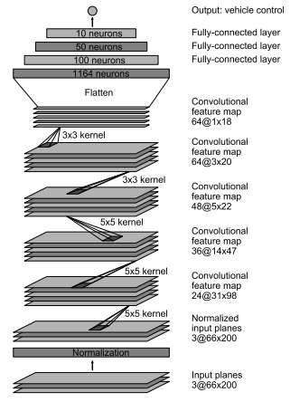

|  Model | Loss   | Val Loss | Map    |
| :----: | :----: | :----:   | :----: |
| train  | 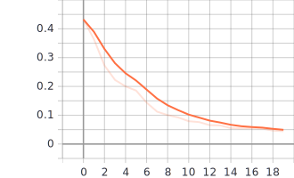 | 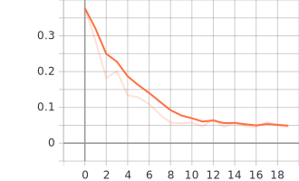 | 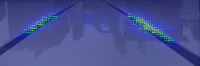 |

## 数据处理
### 原图

### 裁剪
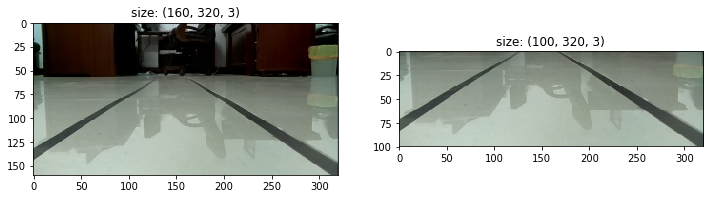
### 放缩
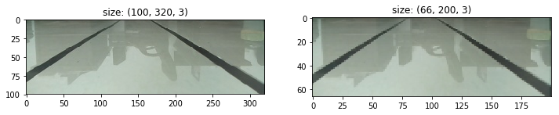
### 翻转
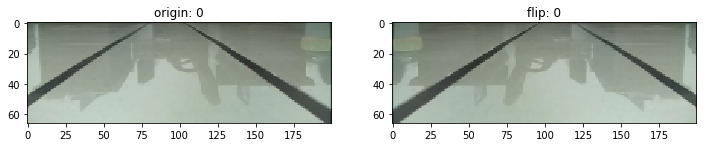
### 数据增强
```
sequence = iaa.Sequential([
    sometime(iaa.GaussianBlur((0, 1.5))),
    sometime(iaa.Sharpen(alpha=(0, 1.0), lightness=(0.75, 1.5))),
    sometime(iaa.AdditiveGaussianNoise(
        loc=0, scale=(0.0, 3.), per_channel=0.5)),
    sometime(iaa.Dropout((0.0, 0.1))),
    sometime(iaa.CoarseDropout((0.10, 0.30),
                               size_percent=(0.02, 0.05), per_channel=0.2)),
    sometime(iaa.Add((-10, 10), per_channel=0.5)),
],
    random_order=True
)
```
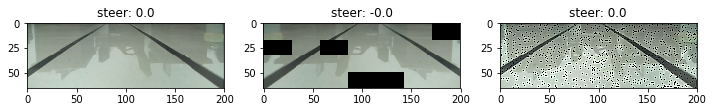
### pre
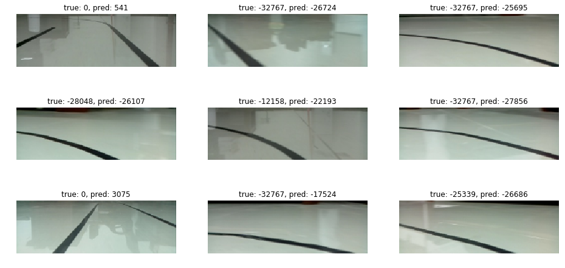
### vis
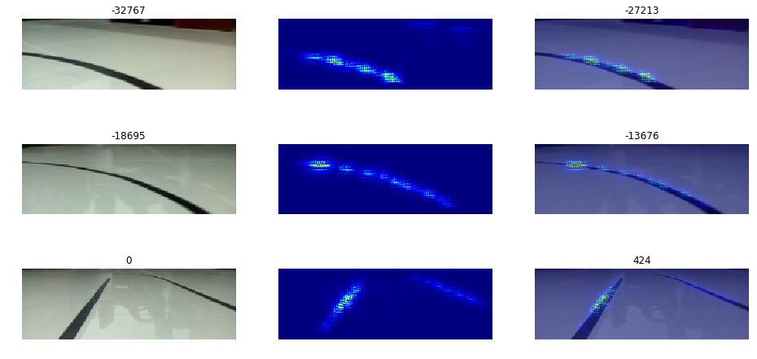

## 小车
| 零件   | 前视图 | 俯视图 |
| :----: | :----: | :----: |
|  | 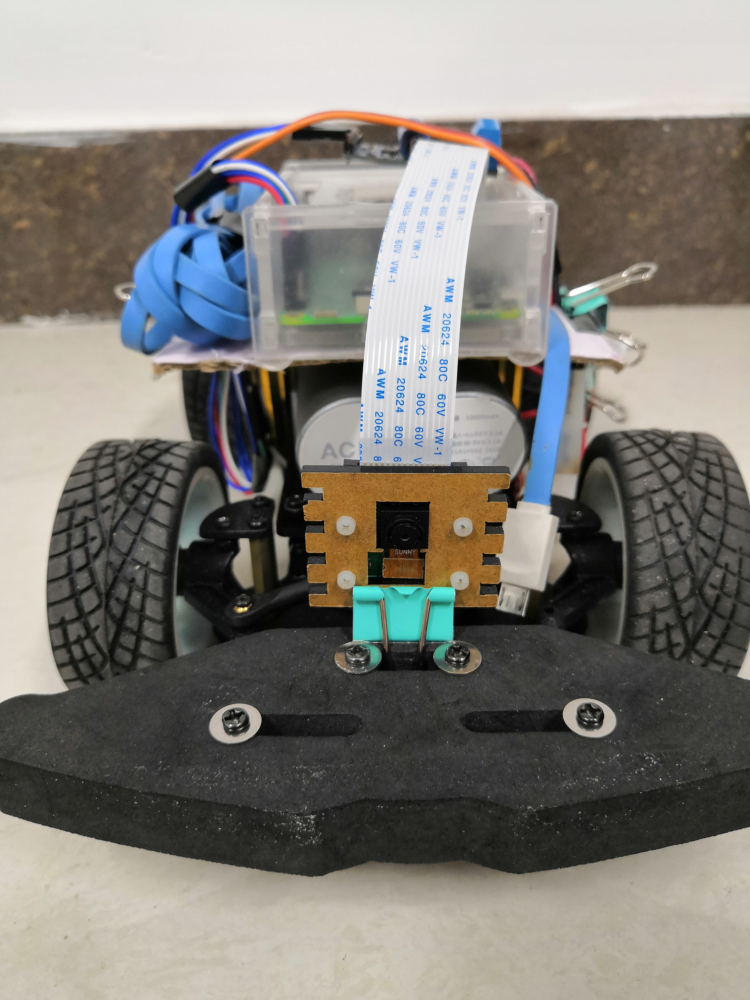 | 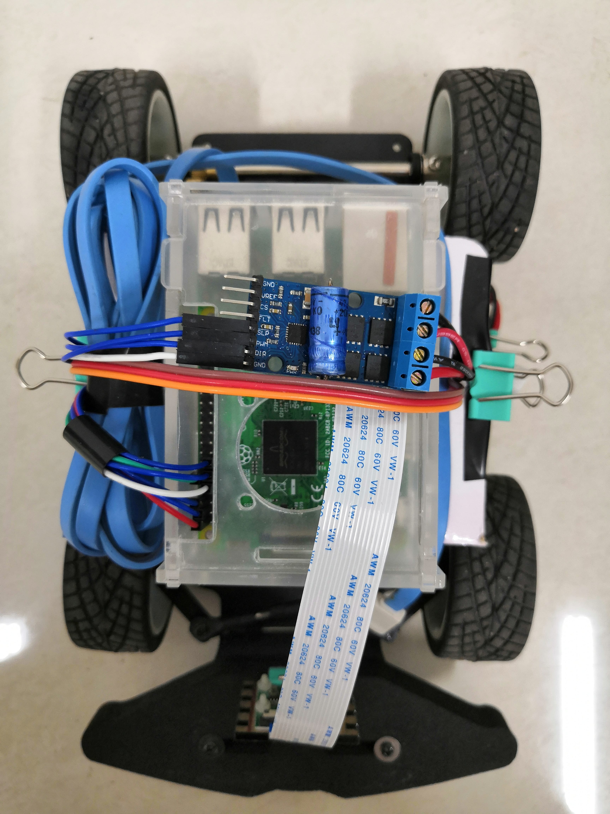 |

### 必要零件
1. [舵机转向小车](https://m.tb.cn/h.3A2XMXm?sm=cc99ea)
2. [电机驱动](https://m.tb.cn/h.3A2237d?sm=8b2ce4)
3. 树莓派
4. 手柄
5. 摄像头
6. 7.4V电池组(两节18650充电电池)
7. 5V充电宝

### 前轮转向
| Brown  | Red    | Orange |
| :----: | :----: | :----: |
| GND    | VCC    | SIG    |

```
# Front Wheel
SIG = 12

# BOARD or BCM
GPIO.setmode(GPIO.BOARD)

GPIO.setup(SIG, GPIO.OUT)
car = GPIO.PWM(SIG, 50)  # 50HZ
car.start(0)
```

### 后轮驱动
| SLP    | PWM    | DIR    | M+     | M-     | Status   |
| :----: | :----: | :----: | :----: | :----: | :----:   |
| H      | H(PWM) | H      | H      | L      | Forward  |
| H      | H(PWM) | L      | L      | H      | Backward |
| H      | L      | X      | L      | L      | Brake    |
| L      | X      | X      | X      | X      | Stop     |

```
# Rear Wheel
SLP = 4
DIR = 11
PWM = 13

# BOARD or BCM
GPIO.setmode(GPIO.BOARD)

# GPIO.setup(SLP, GPIO.OUT)  # +5V (The channel sent is invalid on a Raspberry Pi.)
GPIO.setup(DIR, GPIO.OUT)
GPIO.setup(PWM, GPIO.OUT)
car = GPIO.PWM(PWM, 10*1000)  # 10kHZ-30kHZ
car.start(0)
```

## 手柄


### 手柄测试
```
$ sudo apt-get install joystick

$ jstest /dev/input/js0
Time:0 A:0 B:0 X:0 Y:0 LB:0 RB:0 MENU:0 LO:0 RO:0 LX:0 LY:0 RX:0 RY:0 LT:-32767 RT:-32767 XX:0 YY:0
......
```

### XBOX手柄映射表
| 编码             | 解释       | 编码        | 解释      |
| :----:           | :----:     | :----:      | :----:    |
| BUTTON_A = 0     | 按键A      | AXIS_LX = 0 | 左摇杆X轴 |
| BUTTON_B = 1     | 按键B      | AXIS_LY = 1 | 左摇杆Y轴 |
| BUTTON_X = 3     | 按键X      | AXIS_RX = 2 | 右摇杆X轴 |
| BUTTON_Y = 4     | 按键Y      | AXIS_RY = 3 | 右摇杆Y轴 |
| BUTTON_LB = 6    | 按键L1     | AXIS_LT = 4 | 按键L2    |
| BUTTON_RB = 7    | 按键R1     | AXIS_RT = 5 | 按键R2    |
| BUTTON_MENU = 11 | 按键MENU   | AXIS_XX = 6 | 方向键X轴 |
| BUTTON_LO = 13   | 左摇杆按键 | AXIS_YY = 7 | 方向键Y轴 |
| BUTTON_RO = 14   | 右摇杆按键 |

### PS手柄映射表
| 编码              | 解释       | 编码        | 解释      |
| :----:            | :----:     | :----:      | :----:    |
| BUTTON_A = 0      | 按键A      | AXIS_LX = 0 | 左摇杆X轴 |
| BUTTON_B = 1      | 按键B      | AXIS_LY = 1 | 左摇杆Y轴 |
| BUTTON_X = 2      | 按键X      | AXIS_LT = 2 | 按键L2    |
| BUTTON_Y = 3      | 按键Y      | AXIS_RX = 3 | 右摇杆X轴 |
| BUTTON_LB = 4     | 按键L1     | AXIS_RY = 4 | 右摇杆Y轴 |
| BUTTON_RB = 5     | 按键R1     | AXIS_RT = 5 | 按键R2    |
| BUTTON_SELECT = 6 | 按键MENU   | AXIS_XX = 6 | 方向键X轴 |
| BUTTON_START = 7  | 按键START  | AXIS_YY = 7 | 方向键Y轴 |
| BUTTON_HOME = 8   | 按键HOME   |
| BUTTON_LO =  9    | 左摇杆按键 |
| BUTTON_RO = 10    | 右摇杆按键 |

### 读取手柄数据
根据上述映射表，可以利用python实现jstest命令的功能，即读取/dev/input/js0的数据。\
[Linux内核文档](https://www.kernel.org/doc/Documentation/input/joystick-api.txt)提到手柄事件定义：
```
struct js_event {
__u32 time;	/* 事件时间戳，以毫秒为单位 */
__s16 value;	/* 值 */
__u8 type;		/* 事件类型 */
__u8 number;	/* 轴/按钮编号 */
};
```
直接读取/dev/input/js0内容即可：
```
EVENT_SIZE = struct.calcsize('IhBB')
dev = open('/dev/input/js0', 'rb')
while True:
	event = dev.read(EVENT_SIZE)
	(time, value, type, number) = struct.unpack('IhBB', event)
	# TODO
```

### 树莓派无法连接蓝牙手柄解决方案
```
$ sudo vim /sys/module/bluetooth/parameters/disable_ertm
将N改为1
```

## 摄像头
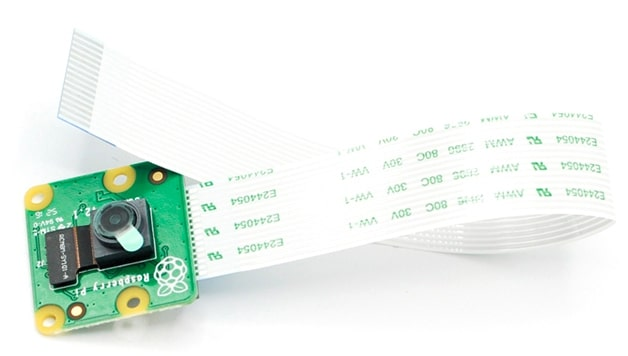

### 拍照测试
```
import picamera
import time

camera = picamera.PiCamera()
camera.resolution = (320, 160)
camera.rotation = 180
camera.start_preview()
time.sleep(5)
camera.capture('photo.jpg')
camera.stop_preview()
```

### 录像测试
```
import picamera
import time

camera = picamera.PiCamera()
camera.resolution = (320, 160)
camera.rotation = 180
camera.start_preview()
camera.start_recording('video.h264')
time.sleep(5)
camera.stop_recording()
camera.stop_preview()
```
